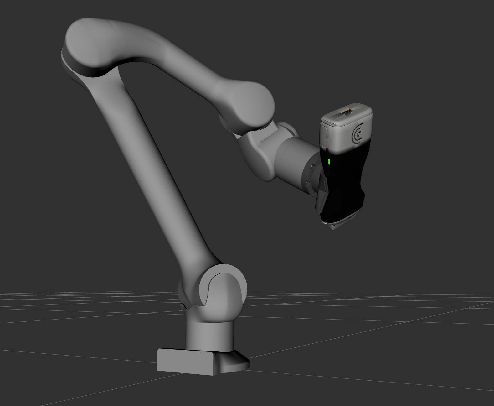

# Z1 Robot Description

This package contains the URDF and the meshes of the Z1 manipulator to work in ROS2.
An additional mount has been added to attach the Clarius C3 HD3 to the end of the arm, which can be specified using the 'end_effector' argument in xacro or when running `display.launch.py`.